# AI Coding 内部培训页面

异乡好居管理干部 AI Coding 培训材料

## 🎯 项目简介

这是一个交互式的 AI Coding 培训页面，展示了：
- 18 个真实 GitHub 项目
- 4 大核心案例深度讲解
- 交互式代码演示
- 完整的避坑指南
- ⚡ **新增**: VibeCoding Prompt 工程技巧（3个层级）
- ⚡ **新增**: AI 工具推荐（6大场景，18+工具）
- ⚡ **新增**: 数据看板生成器 Demo 教程
- ⚡ **新增**: AnyGen AI 工作台推荐
- ⚡ **新增**: Google Analytics 4 流量统计和实时追踪

**技术栈**: 纯静态 HTML + Tailwind CSS + JavaScript

**线上地址**: 
- 主培训页面：https://training.pylosy.com
- Demo 教程：https://training.pylosy.com/demo.html

## 🚀 快速开始

### 本地预览

```bash
# 克隆项目
git clone https://github.com/yalding8/ai-coding-training.git
cd ai-coding-training

# 方法 1: 直接打开
open index.html

# 方法 2: 本地服务器（推荐）
python3 -m http.server 8000
# 访问 http://localhost:8000
```

## 📦 部署到服务器

### 智能部署脚本（推荐）

使用增强版 `deploy-smart.sh` 脚本，支持多种部署方式：

```bash
# 添加 SSH Key 到 agent（避免重复输入密码）
ssh-add ~/.ssh/id_ed25519

# 运行智能部署
chmod +x deploy-smart.sh
./deploy-smart.sh root@YOUR_SERVER_IP
```

**部署选项**：
1. **端口 8080** - 独立端口部署（推荐用于测试）
2. **子路径 /training** - 与现有服务共存
3. **覆盖端口 80** - 完全接管 80 端口（慎用）
4. **域名部署** - 使用自定义域名（支持自定义端口，自动检测并配置 SSL）

### 自动化功能

- ✅ 自动检测服务器连接
- ✅ 自动检测端口占用
- ✅ 强制同步代码（解决 Git 冲突）
- ✅ 支持自定义 Nginx 监听端口
- ✅ **自动检测并配置 SSL 证书**（certbot）
- ✅ 智能选择 HTTP/HTTPS 访问地址

### GitHub Actions 自动部署（推荐）

项目已配置 GitHub Actions，每次推送到 `main` 分支时自动部署到生产服务器。

#### 首次配置

1. **在 GitHub 仓库设置 Secrets**

进入仓库 `Settings` → `Secrets and variables` → `Actions`，添加以下 Secrets：

```
SERVER_HOST=188.166.250.114
SERVER_USER=root
SSH_PRIVATE_KEY=<你的私钥内容>
```

获取私钥内容：
```bash
cat ~/.ssh/id_ed25519
# 复制全部内容（包括 BEGIN 和 END 行）
```

2. **触发部署**

```bash
# 方式 1: 推送代码自动触发
git push origin main

# 方式 2: GitHub 网页手动触发
# 进入 Actions → Deploy to Production → Run workflow
```

#### 部署流程

```mermaid
graph LR
    A[推送代码] --> B[GitHub Actions 触发]
    B --> C[连接服务器]
    C --> D[拉取最新代码]
    D --> E[重载 Nginx]
    E --> F[部署完成✅]
```



**优势**：
- ✅ 零手动操作，推送即部署
- ✅ 部署记录可追溯
- ✅ 失败自动回滚（Git reset）
- ✅ 支持手动触发部署

**查看部署状态**：
- GitHub 仓库 → `Actions` 标签
- 每次部署都有详细日志

### 选项 2: 手动部署

```bash
# 1. SSH 到服务器
ssh root@YOUR_SERVER_IP

# 2. 克隆代码
cd /var/www
git clone https://github.com/yalding8/ai-coding-training.git

# 3. 配置 Nginx
sudo nano /etc/nginx/sites-available/ai-coding-training
# 粘贴配置（见下方）

# 4. 启用站点
sudo ln -s /etc/nginx/sites-available/ai-coding-training /etc/nginx/sites-enabled/
sudo nginx -t
sudo systemctl reload nginx
```

### Nginx 配置示例

```nginx
server {
    listen 80;
    server_name training.yourdomain.com;  # 或使用 IP

    root /var/www/ai-coding-training;
    index index.html;

    location / {
        try_files $uri $uri/ /index.html;
    }

    # Gzip 压缩
    gzip on;
    gzip_types text/plain text/css text/javascript application/javascript;
}
```

### 选项 3: 使用子路径部署（如果端口 80 被占用）

如果服务器上已有其他网站运行，可以将培训页面部署到子路径：

```nginx
# 添加到现有 Nginx 配置中
location /training {
    alias /var/www/ai-coding-training;
    index index.html;
    try_files $uri $uri/ /training/index.html;
}
```

访问地址: http://YOUR_SERVER_IP/training

## 🌐 绑定域名（可选）

### 1. DNS 配置

在你的域名服务商添加 A 记录：

```
training.yourdomain.com  →  YOUR_SERVER_IP
```

### 2. 更新 Nginx 配置

```bash
ssh root@YOUR_SERVER_IP
sudo nano /etc/nginx/sites-available/ai-coding-training
# 修改 server_name 为你的域名
sudo systemctl reload nginx
```

### 3. 配置 SSL（推荐）

**自动配置（推荐）**：
```bash
ssh root@YOUR_SERVER_IP
certbot --nginx -d training.yourdomain.com --non-interactive --agree-tos --register-unsafely-without-email --redirect
```

**注意事项**：
- 如果使用 Cloudflare CDN，建议将 SSL/TLS 模式设置为 **Full** 或 **Full (Strict)**
- 部署脚本会自动检测 SSL 证书并配置 HTTPS
- 推荐配置：同时监听 80 和 443，不强制跳转（兼容 Cloudflare Flexible 模式）

## 🎯 使用 Demo 教程

### 在线访问

直接访问：https://training.pylosy.com/demo.html

### 培训现场使用

**方案 A：跟随在线教程**
1. 投屏展示 `demo.html` 页面
2. 员工按步骤操作（准备环境 → AI 辅助编码 → 运行脚本 → 查看成果）
3. 使用提供的 AI Prompt 在 Cursor/Claude 中生成代码
4. 30分钟内完成数据看板生成器

**方案 B：下载资源包**
```bash
# 下载示例数据和代码模板
wget https://training.pylosy.com/sales_data.csv
wget https://training.pylosy.com/dashboard_generator.py

# 安装依赖
pip install pandas plotly

# 运行示例
python dashboard_generator.py

# 查看生成的看板
open dashboard.html
```

**教学要点**：
- 强调 AI 辅助编程的价值（用 Prompt 生成代码）
- 展示即时反馈（现场运行看到图表）
- 鼓励员工用自己的数据尝试
- 可扩展性：添加更多图表类型、数据源

## � Google Analytics 配置

### 快速开始

项目已集成 Google Analytics 4 (GA4) 流量统计，但需要配置你的衡量 ID。

**1. 创建 GA4 账号**
- 访问：https://analytics.google.com/
- 创建媒体资源，获取衡量 ID（格式：`G-XXXXXXXXXX`）

**2. 替换代码中的 ID**

在 `index.html` 和 `demo.html` 中找到并替换：
```html
<!-- 替换两处 GA_MEASUREMENT_ID -->
<script async src="https://www.googletagmanager.com/gtag/js?id=GA_MEASUREMENT_ID"></script>
<script>
    gtag('config', 'GA_MEASUREMENT_ID', {
```

替换为你的实际 ID：
```html
<script async src="https://www.googletagmanager.com/gtag/js?id=G-ABC1234XYZ"></script>
<script>
    gtag('config', 'G-ABC1234XYZ', {
```

**3. 查看实时数据**
- Google Analytics → 报告 → 实时
- 可以看到访问者数量、地理位置、访问页面等

**详细配置指南**: 查看 [ANALYTICS_SETUP.md](ANALYTICS_SETUP.md)

### 追踪的数据

- ✅ 页面浏览量、用户数、sessions
- ✅ 流量来源、地理位置、设备类型
- ✅ 自定义事件：GitHub链接点击、导航使用、滚动深度
- ✅ 页面加载时间、停留时长

## �📝 更新内容

当你修改了代码后：

### 方式 1: 自动部署（推荐）

```bash
# 本地提交并推送
git add .
git commit -m "更新内容"
git push origin main

# GitHub Actions 会自动部署到服务器 🚀
# 访问 https://github.com/yalding8/ai-coding-training/actions 查看部署状态
```

### 方式 2: 手动同步

```bash
# 服务器更新
ssh root@YOUR_SERVER_IP "cd /var/www/ai-coding-training && git pull"
```

或直接运行部署脚本：
```bash
./deploy.sh
```

## 📂 项目结构

```
ai-coding-training/
├── .github/
│   └── workflows/
│       └── deploy.yml          # GitHub Actions 自动部署配置
├── index.html              # 主培训页面
├── demo.html               # 数据看板生成器 Demo 教程
├── dashboard_generator.py  # Python 示例代码
├── sales_data.csv          # 示例数据文件
├── deploy.sh               # 基础部署脚本
├── deploy-smart.sh         # 智能部署脚本（推荐）
├── fix-502.sh              # 502 错误修复脚本
├── CLOUDFLARE_FIX.md       # Cloudflare 故障排查指南
├── DEVELOPMENT_RULES.md    # 开发规则与最佳实践
├── FIREWALL_SETUP.md       # 防火墙配置说明
└── README.md               # 说明文档
```

## 🎨 特性

### 主培训页面
- ✨ 深色代码美学设计
- 📱 完全响应式（支持移动端）
- ⚡ 平滑滚动动画
- 🔗 真实 GitHub 项目链接
- 💻 可展开的代码块
- 🎯 交互式导航
- ⚡ **新增**: VibeCoding Prompt 工程技巧（3级进阶）
- ⚡ **新增**: AI 工具推荐（6大场景分类）
- ⚡ **新增**: 新手工具箱（Obsidian/VSCode/Trae/Get笔记/GitHub/AI Studio/博主推荐）
- ⚡ **新增**: AnyGen AI 工作台特别推荐

### Demo 教程页面
- 📖 30分钟交互式实操教程
- 📋 分步指导（准备→编码→运行→查看）
- 🤖 AI Prompt 模板（Cursor/Claude 辅助）
- 📋 一键复制代码功能
- 🔧 故障排查指南
- 📊 完整 Python + Plotly 示例

## 📊 包含的项目案例

1. **salary-calculator** - 薪资计算器（JavaScript）
2. **ai-news-bot** - AI 新闻机器人（Python）
3. **market-scanner** - 市场扫描器（HTML）
4. **aitest** - AI 能力测试系统（Python） ⭐ 公开
5. **ai-podcast** - 播客自动化系统（Python）
6. **uhomespay** - 支付系统（JavaScript + Vue）
7. 更多 12 个项目...

## 🔧 常见问题

**Q: 访问不了怎么办？**
- 检查服务器防火墙是否开放 80/443 端口
- 检查 Nginx 是否正常运行：`systemctl status nginx`
- 查看 Nginx 错误日志：`tail -f /var/log/nginx/error.log`

**Q: 遇到 ERR_TOO_MANY_REDIRECTS 怎么办？**
- 检查 Cloudflare SSL/TLS 模式（推荐使用 Full）
- 确认 Nginx 配置同时监听 80 和 443，且不强制重定向
- 清除浏览器缓存或使用隐身模式

**Q: 如何修改端口？**
- 使用 `deploy-smart.sh` 选项 4，可自定义监听端口
- 或手动编辑 Nginx 配置，修改 `listen 80;` 为其他端口

**Q: 部署时一直要求输入 SSH 密码？**
```bash
# 将 SSH Key 添加到 agent
ssh-add ~/.ssh/id_ed25519
```

**Q: 如何添加访问密码？**
```bash
# 创建密码文件
sudo apt-get install apache2-utils
sudo htpasswd -c /etc/nginx/.htpasswd training_user

# 在 Nginx 配置中添加
auth_basic "Restricted Access";
auth_basic_user_file /etc/nginx/.htpasswd;
```

## 🛠️ 开发与贡献

### 开发规则

在修改部署脚本或 Nginx 配置前，请务必阅读：
👉 **[DEVELOPMENT_RULES.md](DEVELOPMENT_RULES.md)**

该文档包含：
- Nginx 配置标准
- 部署脚本开发规范
- Cloudflare 集成指南
- 代码审查检查清单
- 测试验证流程
- 常见错误案例

### 故障排查

遇到部署或访问问题？请查看：
- **重定向循环问题**: [CLOUDFLARE_FIX.md](CLOUDFLARE_FIX.md)
- **开发规则**: [DEVELOPMENT_RULES.md](DEVELOPMENT_RULES.md)
- **防火墙配置**: [FIREWALL_SETUP.md](FIREWALL_SETUP.md)

## 📞 联系方式

- **GitHub**: [@yalding8](https://github.com/yalding8)
- **项目地址**: https://github.com/yalding8/ai-coding-training

## 📄 许可证

Copyright © 2026 异乡好居 Uhomes
